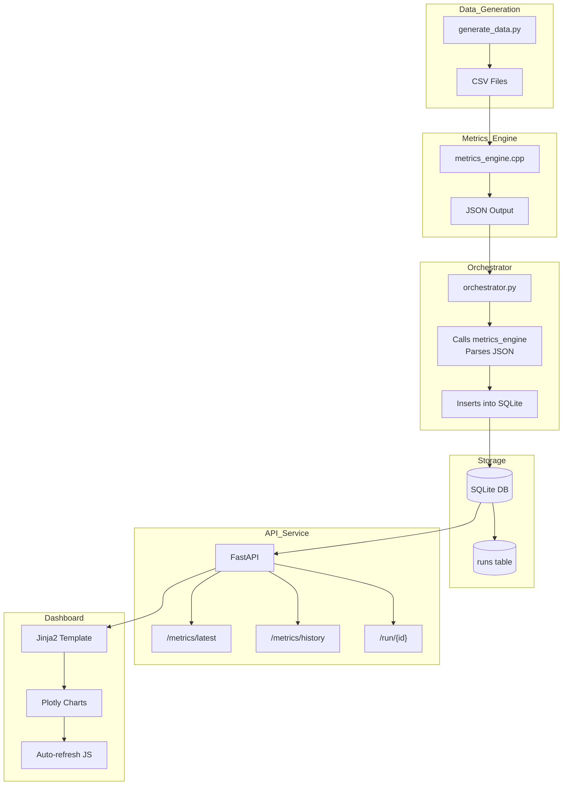

# **DQM Lite — A Mini Data Quality Monitoring Pipeline**


**DQM Lite** is a lightweight, end‑to‑end Data Quality Monitoring (DQM) system inspired by real observability pipelines used in scientific experiments and distributed systems.  
It demonstrates how data flows through a modern monitoring stack: **generation → processing → storage → API → dashboard**.

This project blends **Python**, **C++**, **FastAPI**, **SQLite**, **Plotly**, and **Jinja2** into a clean, modular architecture suitable for learning, showcasing, or extending into more advanced monitoring tools.

---

## Features

- **Synthetic Data Generator**  
  Creates realistic CSV files simulating sensor or detector readings, including anomalies.

- **C++ Metrics Engine**  
  High‑performance computation of mean, standard deviation, and outlier counts.

- **Python Orchestrator**  
  Coordinates the workflow: reads CSVs, invokes the C++ engine, parses JSON output, and stores results.

- **SQLite Run Registry**  
  A persistent database storing metrics for each processed run.

- **FastAPI Service**  
  Clean REST endpoints for metrics, history, and run‑level inspection.

- **Plotly Dashboard (Auto‑Refreshing)**  
  Interactive charts that update every 5 seconds using a JavaScript fetch loop.

- **One‑Command Pipeline (`run.sh`)**  
  Generate → Process → Store → Serve → Visualize.

---

## Architecture

The system is composed of modular, well‑defined components that work together to form a complete Data Quality Monitoring pipeline. Each layer has a single responsibility, making the system easy to understand, extend, and maintain.




### **Component Breakdown**

#### **1. Data Generation Layer**
- `generate_data.py`  
  Produces synthetic CSV files simulating detector/sensor readings, including anomalies.

#### **2. Metrics Engine (C++)**
- `metrics_engine.cpp`  
  Computes:
  - Mean  
  - Standard deviation  
  - Outlier count  
  Returns results as JSON.

#### **3. Orchestrator Layer**
- `orchestrator.py`  
  - Iterates through CSV files  
  - Calls the C++ engine  
  - Parses JSON output  
  - Inserts results into SQLite  

#### **4. Storage Layer**
- `dqm.db`  
  - Stores run metadata and computed metrics  
  - Acts as the run registry  

#### **5. API Layer (FastAPI)**
- `api.py`  
  Exposes:
  - `/metrics/latest`  
  - `/metrics/history`  
  - `/run/{id}`  
  - `/dashboard`  

#### **6. Dashboard Layer**
- `dashboard.html` + Plotly  
  - Interactive charts  
  - Auto-refresh every 5 seconds  
  - Fetches data from `/metrics/history`  

This layered architecture mirrors real-world monitoring systems, ensuring clarity, modularity, and extensibility.
```


---

## ▶️ Running the Entire Pipeline

### **One command to run everything:**

```bash
./run.sh
```

This will:

1. Generate synthetic CSV data  
2. Build the C++ metrics engine  
3. Process all runs  
4. Populate SQLite  
5. Launch the FastAPI server  
6. Serve the dashboard  

Open the dashboard at:

```
http://localhost:8000/dashboard
```

---

## API Endpoints

| Endpoint | Description |
|---------|-------------|
| `/` | Redirects to dashboard |
| `/dashboard` | Interactive Plotly dashboard |
| `/metrics/latest` | Latest processed run |
| `/metrics/history` | Full run history |
| `/run/{id}` | Metrics for a specific run |
| `/health` | Service health check |

---

## Dashboard

The dashboard includes:

- Mean per Run (line plot)  
- Stddev per Run (line plot)  
- Outlier Count per Run (bar chart)  
- GOOD/BAD color coding  
- Auto-refresh every 5 seconds  

Built using:

- Plotly  
- Jinja2  
- FastAPI  
- JavaScript fetch loop  

---

## Future Enhancements

- [ ] Real-time ingestion (streaming)
- [ ] WebSocket-based live updates
- [ ] Alerting system (threshold-based)
- [ ] Docker containerization
- [ ] CI/CD pipeline
- [ ] Multi-metric dashboards
- [ ] Grafana/Prometheus integration

---

## License

MIT License — free to use, modify, and extend.
